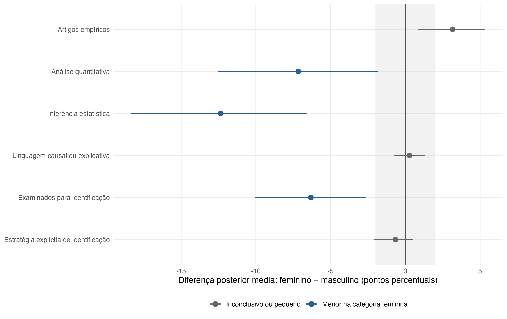

# Análise bayesiana hierárquica por classificação binária do primeiro prenome

**Data de execução:** 2026-07-19

## Síntese

A inferência principal substitui os testes separados de proporções e o ajuste de Mantel–Haenszel por seis modelos logísticos hierárquicos. Os artigos formam o primeiro nível; os nove periódicos elegíveis são tratados como unidades permutáveis no segundo nível. Tanto o intercepto quanto a diferença associada à categoria feminina variam entre periódicos e recebem pooling parcial; um intercepto cruzado por primeiro autor acomoda publicações repetidas da mesma pessoa.

Há probabilidade posterior de pelo menos 95% de uma diferença menor que −2 p.p. para: Análise quantitativa; Inferência estatística; Examinados para identificação. Há probabilidade posterior de pelo menos 95% de uma diferença maior que +2 p.p. para: nenhum indicador. Os demais resultados são inconclusivos ou pequenos segundo essa margem: Artigos empíricos; Linguagem causal ou explicativa; Estratégia explícita de identificação.

As estimativas são descritivas e correlacionais. O modelo descreve associações condicionais a periódico e período; não identifica efeito causal de gênero.

## Especificação

Para cada indicador binário pré-especificado, foi ajustado:

`logit Pr(y_iaj = 1) = α_j + β_j Feminino_iaj + γ_2 Período2_iaj + γ_3 Período3_iaj + u_a`,

em que `(α_j, β_j)` segue uma distribuição normal multivariada entre periódicos e `u_a` é um intercepto aleatório do primeiro autor. O contraste reportado é a diferença posterior de probabilidade entre `Feminino = 1` e `Feminino = 0`, padronizada pela composição observada de periódico e período no denominador de cada indicador e avaliada em `u_a = 0` (autor típico).

O pooling parcial regulariza sobretudo os contrastes de periódicos com poucos artigos ou eventos. Por isso não se corrigem p-valores para as nove comparações: elas são estimadas conjuntamente. O argumento segue Gelman, Hill e Yajima (2012), que recomendam modelagem multilevel quando efeitos relacionados são permutáveis.

Aqui, permutabilidade é uma hipótese operacional de regularização entre os nove periódicos observados, não uma afirmação de que eles tenham o mesmo escopo editorial. O estimando não é generalizado a uma população abstrata de periódicos nem a títulos fora da base.

Ressalva: os seis indicadores são desfechos distintos e foram estimados separadamente. O pooling entre periódicos não elimina automaticamente a multiplicidade entre desfechos; todas as seis comparações são exploratórias e não constituem uma regra de descoberta. Reportam-se a distribuição posterior, a direção e a probabilidade de diferença substantiva maior que 2 p.p.

## Resultados

**Tabela 1. Diferenças posteriores padronizadas entre as categorias feminina e masculina do primeiro prenome**

| Indicador | N | Diferença posterior média F−M | ICr 95% | Pr(F−M > 0) | Pr(F−M < −2 p.p.) | Pr(F−M > +2 p.p.) | Pr(ROPE ±2 p.p.) |
| --- | --- | --- | --- | --- | --- | --- | --- |
| Artigos empíricos | 3.970 | +3,2 p.p. | [+0,9 p.p.; +5,3 p.p.] | 0,998 | < 0,001 | 0,844 | 0,156 |
| Análise quantitativa | 3.276 | -7,2 p.p. | [-12,5 p.p.; -1,8 p.p.] | 0,004 | 0,970 | < 0,001 | 0,030 |
| Inferência estatística | 1.938 | -12,4 p.p. | [-18,3 p.p.; -6,6 p.p.] | < 0,001 | > 0,999 | < 0,001 | < 0,001 |
| Linguagem causal ou explicativa | 3.276 | +0,3 p.p. | [-0,7 p.p.; +1,3 p.p.] | 0,710 | < 0,001 | < 0,001 | > 0,999 |
| Examinados para identificação | 3.970 | -6,3 p.p. | [-10,0 p.p.; -2,7 p.p.] | < 0,001 | 0,987 | < 0,001 | 0,013 |
| Estratégia explícita de identificação | 1.359 | -0,7 p.p. | [-2,1 p.p.; +0,5 p.p.] | 0,118 | 0,029 | < 0,001 | 0,971 |

*Nota:* F−M é feminino menos masculino. ICr é o intervalo de credibilidade posterior de 95%. A ROPE de ±2 p.p. é uma margem descritiva de equivalência prática, não um limiar universal.

Como ±2 p.p. não tem a mesma importância relativa em desfechos raros e comuns, `output/tables/gender_analysis/table_17_bayesian_rope_sensitivity.csv` reapresenta as probabilidades para margens de ±1, ±2, ±3 e ±5 p.p.; o ICr e a probabilidade de direção permanecem as medidas sem dependência dessa escolha.

*Figura 1. Diferenças posteriores padronizadas entre as categorias feminina e masculina do primeiro prenome.* As barras são ICr de 95%; a faixa cinza é a ROPE de ±2 p.p.

Os contrastes parcialmente agrupados por periódico estão em `output/tables/gender_analysis/table_14_bayesian_gender_effects_by_journal.csv`. Com nove periódicos, a heterogeneidade entre eles tem incerteza relevante.

## Priors

Foram usadas priors fracamente informativas, não priors impróprias ou supostamente não informativas:

- intercepto global: Student-t(3, 0, 2,5);
- coeficientes globais de gênero e período: Normal(0, 0,75) na escala logit;
- desvios-padrão dos efeitos aleatórios de periódico e autor: half-Student-t(3, 0, 1);
- correlação entre intercepto e contraste do periódico: LKJ(2).

A regularização segue Gelman (2006) para priors half-t em escalas hierárquicas e Gelman et al. (2008) para priors fracamente informativas em regressão logística. Priors próprias estabilizam especialmente o indicador raro de estratégia explícita de identificação.

## Diagnósticos

**Tabela 2. Diagnósticos dos modelos bayesianos hierárquicos**

| Indicador | N | Eventos | Iterações (warmup) | R-hat máximo | ESS bulk mínimo | ESS tail mínimo | Divergências | Saturações de treedepth | PPC prevalência |
| --- | --- | --- | --- | --- | --- | --- | --- | --- | --- |
| Artigos empíricos | 3.970 | 3.276 | 2.000 (1.000) | 1,008 | 467 | 924 | 0 | 0 | PASS |
| Análise quantitativa | 3.276 | 1.943 | 4.000 (2.000) | 1,004 | 1.057 | 1.833 | 0 | 0 | PASS |
| Inferência estatística | 1.938 | 727 | 2.000 (1.000) | 1,007 | 658 | 1.162 | 0 | 0 | PASS |
| Linguagem causal ou explicativa | 3.276 | 3.185 | 4.000 (2.000) | 1,004 | 983 | 1.850 | 0 | 0 | PASS |
| Examinados para identificação | 3.970 | 1.359 | 2.000 (1.000) | 1,007 | 747 | 1.423 | 0 | 0 | PASS |
| Estratégia explícita de identificação | 1.359 | 59 | 4.000 (2.000) | 1,008 | 893 | 1.081 | 0 | 0 | PASS |

*Nota:* cada modelo usou 4 cadeias e a quantidade de iterações indicada na tabela, `adapt_delta = 0.99` e `max_treedepth = 12`. PASS exige R-hat < 1,01, ESS bulk e tail mínimos ≥ 400, nenhuma divergência, nenhuma saturação de treedepth e prevalência observada dentro do intervalo preditivo posterior de 95%.

Checagens preditivas adicionais por categoria do prenome, periódico, período e pela combinação desses três eixos estão em `output/tables/gender_analysis/table_16_bayesian_grouped_ppc.csv`. Células pequenas podem ficar fora de intervalos pontuais de 95%; por isso essa tabela é diagnóstico localizado, não um novo teste múltiplo.

## População e limites

A entrada é derivada do CSV canônico corrente e exclui `Lua Nova: Revista de Cultura e Política`, `Novos estudos CEBRAP`, `Brazilian Journal of Political Economy` e `Civitas - Revista de Ciências Sociais`. Somente artigos cujo primeiro prenome foi classificado como feminino ou masculino entram nos modelos.

A proxy não observa identidade de gênero, exclui identidades não binárias e tem não classificação diferencial. A ordem de autoria não mede contribuição. O intercepto de autor usa o nome completo normalizado como identificador aproximado: pode unir homônimos ou separar variantes da mesma pessoa. O modelo não trata a classificação como incerta e não controla subcampo, idioma ou coautoria.

Os denominadores são condicionais e não diretamente comparáveis: inferência estatística é estimada entre artigos quantitativos, e estratégia explícita entre artigos examinados para identificação. Esses recortes podem introduzir seleção. A análise descritiva anterior mostrou estabilidade bruta nos limiares de classificação 0,80, 0,90 e 0,95; os modelos hierárquicos não propagam essa incerteza nem imputam os 187 casos não classificados.

## Reprodutibilidade

- Script gerador: `scripts/54_fit_bayesian_gender_hierarchical.R`.
- Base de entrada: `data/processed/gender_analysis/current_canonical_article_gender.csv`, gerada por `scripts/51_analyze_gender_current_canonical.R`.
- MD5 da base de entrada: `9ba855c38cb5509c2c778b0237ff7f22`.
- Ambiente: `R 4.4.2; brms 2.23.0; cmdstanr 0.9.0; posterior 1.6.1; CmdStan 2.37.0`.
- Os objetos `brmsfit` são cache local em `data/processed/gender_analysis/bayesian_models/` e não são versionados devido ao tamanho.

## Referências metodológicas

- Gelman, A. (2006). Prior distributions for variance parameters in hierarchical models. *Bayesian Analysis*, 1(3), 515–534. https://doi.org/10.1214/06-BA117A
- Gelman, A., Jakulin, A., Pittau, M. G., & Su, Y.-S. (2008). A weakly informative default prior distribution for logistic and other regression models. *The Annals of Applied Statistics*, 2(4), 1360–1383. https://doi.org/10.1214/08-AOAS191
- Gelman, A., Hill, J., & Yajima, M. (2012). Why we (usually) don’t have to worry about multiple comparisons. *Journal of Research on Educational Effectiveness*, 5(2), 189–211. https://doi.org/10.1080/19345747.2011.618213

## Validações automáticas

**Tabela 3. Validações da análise bayesiana**

| Validação | Status |
| --- | --- |
| PIDs únicos na base de entrada | PASS |
| Apenas categorias binárias entram nos modelos | PASS |
| Nove periódicos em todos os denominadores | PASS |
| Desfechos binários com variação | PASS |
| R-hat, ESS e amostragem NUTS aprovados | PASS |
| Prevalência observada coberta pela checagem preditiva posterior | PASS |
| Probabilidades posteriores dentro de [0, 1] | PASS |
