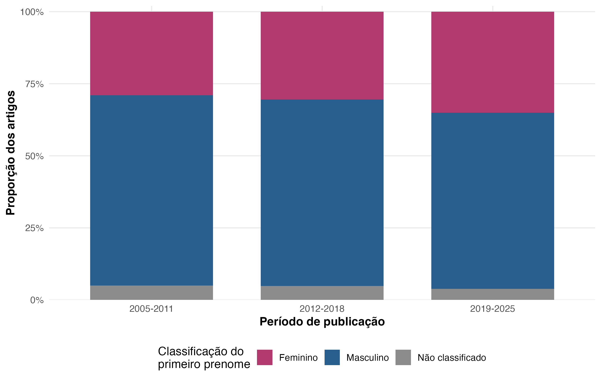
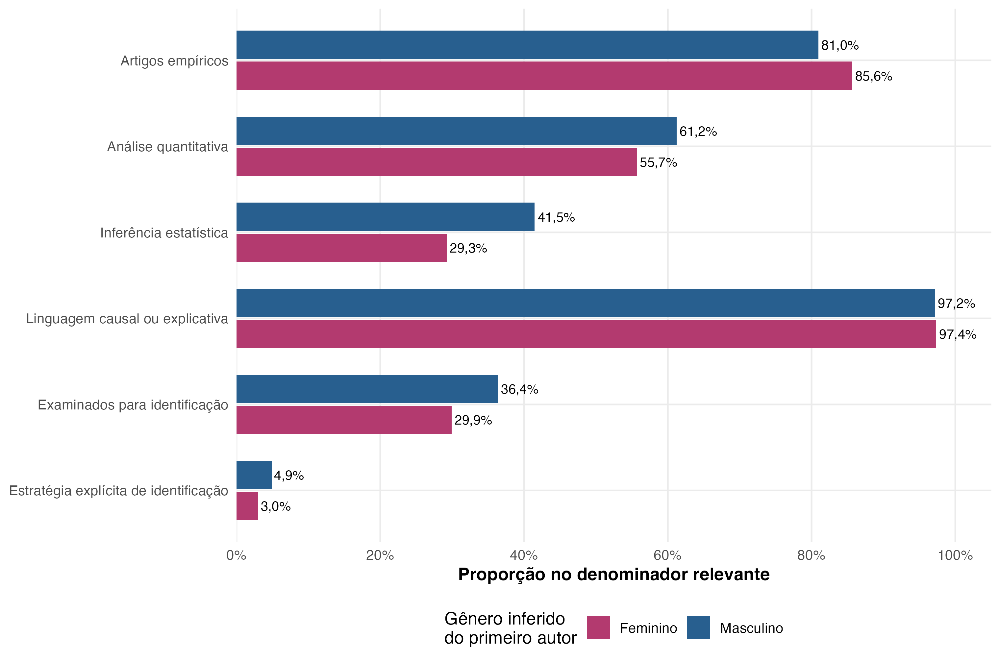

# Análise adicional por classificação binária inferida dos prenomes de autoria

**Data de execução:** 2026-07-19

**Nota de escopo:** esta versão do relatório foi gerada antes da aplicação final do ledger de artigos inelegíveis e parte de 4.157 registros após as exclusões de periódicos. Para o paper, os 13 PIDs inelegíveis presentes nessa base foram removidos por `scripts/56_reconcile_gender_to_paper_scope.R`; os resultados incorporados ao manuscrito usam 4.144 artigos e os artefatos com sufixo `_paper_scope`.

## Síntese

A análise parte dos 4.389 PIDs distintos do CSV canônico corrente. Após as exclusões de escopo, restam 4.157 artigos; 232 registros foram retirados. O `genderBR` classificou o primeiro prenome como feminino ou masculino em 3.970 casos (95,5%).

Entre os primeiros prenomes classificados, 1.323 (33,3%) ficaram na categoria feminina e 2.647 na masculina. Outros 187 artigos permaneceram sem classificação binária; 15 deles não tinham autoria registrada no manifest.

As diferenças brutas de composição indicam análise quantitativa em 55,7% dos artigos com primeiro prenome feminino e 61,2% daqueles com primeiro prenome masculino (-5,5 p.p.). Após padronização descritiva pela distribuição conjunta de periódico e período, a diferença é -5,1 p.p.; para inferência estatística, é -13,4 p.p.

Entre os artigos examinados para identificação — e somente nesse denominador — estratégias explícitas aparecem em 3,0% na categoria feminina e 4,9% na masculina.

Essas diferenças são descritivas e correlacionais. A classificação do prenome não observa identidade de gênero nem necessariamente o sexo de cada pessoa; tampouco os contrastes identificam preferências individuais ou efeitos de gênero.

A inferência está exclusivamente no relatório bayesiano `quality_reports/gender_analysis_bayesian_hierarchical.md`; o presente relatório limita-se à descrição dos dados.

## População analítica e exclusões

A população de partida é o CSV canônico de classificações por leitura integral. Foram excluídos `Lua Nova: Revista de Cultura e Política` e `Novos estudos CEBRAP`, conforme solicitado. Também foram aplicadas as regras permanentes para `Brazilian Journal of Political Economy` e `Civitas - Revista de Ciências Sociais`; estes dois periódicos já tinham zero registros no CSV de partida.

Os resultados descrevem somente os artigos já presentes no snapshot canônico corrente; não são extrapolados para artigos que ainda não tenham sido incorporados a esse CSV.

**Tabela 1. Exclusões de periódicos aplicadas ao CSV canônico**

| Periódico | Base da exclusão | Registros removidos do CSV |
| --- | --- | --- |
| Brazilian Journal of Political Economy | Regra permanente de escopo do projeto | 0 |
| Civitas - Revista de Ciências Sociais | Regra permanente de escopo do projeto | 0 |
| Lua Nova: Revista de Cultura e Política | Exclusão solicitada para esta análise | 100 |
| Novos estudos CEBRAP | Exclusão solicitada para esta análise | 132 |

*Nota:* contagens zero indicam que a regra foi verificada, mas o periódico já não estava no CSV canônico de partida.

**Tabela 2. Classificação binária inferida do primeiro prenome**

| Classificação do primeiro prenome | Artigos | Proporção do corpus |
| --- | --- | --- |
| Feminino | 1.323 | 31,8% |
| Masculino | 2.647 | 63,7% |
| Não classificado | 187 | 4,5% |

*Nota:* a proporção usa todos os artigos da base analítica. `Não classificado` inclui autoria ausente, prenomes não encontrados e probabilidades que não ultrapassam o limiar de 90%.

**Tabela 3. Composição das classificações de prenomes na equipe de autoria**

| Composição dos prenomes na equipe | Artigos | Proporção do corpus |
| --- | --- | --- |
| Somente prenomes classificados como femininos | 892 | 21,5% |
| Somente prenomes classificados como masculinos | 2.138 | 51,4% |
| Prenomes classificados nas duas categorias | 832 | 20,0% |
| Indeterminada | 295 | 7,1% |

*Nota:* uma equipe é `Indeterminada` quando ao menos um autor não pôde ser classificado. A regra evita atribuir composição exclusivamente feminina ou masculina com informação incompleta.

*Figura 1. Classificação binária inferida do primeiro prenome por período de publicação.*

## Indicadores metodológicos por classificação do primeiro prenome

**Tabela 4. Indicadores metodológicos segundo a classificação do primeiro prenome**

| Indicador | Feminino: n/N | Feminino: % | Masculino: n/N | Masculino: % | Diferença F−M |
| --- | --- | --- | --- | --- | --- |
| Artigos empíricos | 1.133/1.323 | 85,6% | 2.143/2.647 | 81,0% | +4,7 p.p. |
| Análise quantitativa | 631/1.133 | 55,7% | 1.312/2.143 | 61,2% | -5,5 p.p. |
| Inferência estatística | 184/629 | 29,3% | 543/1.309 | 41,5% | -12,2 p.p. |
| Linguagem causal ou explicativa | 1.103/1.133 | 97,4% | 2.082/2.143 | 97,2% | +0,2 p.p. |
| Examinados para identificação | 396/1.323 | 29,9% | 963/2.647 | 36,4% | -6,4 p.p. |
| Estratégia explícita de identificação | 12/396 | 3,0% | 47/963 | 4,9% | -1,9 p.p. |

*Nota:* cada célula apresenta numerador/denominador. Os denominadores são: todos os artigos para artigos empíricos; artigos empíricos com classificação observada para análise quantitativa e linguagem causal/explicativa; artigos quantitativos com inferência observada para inferência estatística; todos os artigos com screen observado para exame de identificação; e artigos examinados para identificação para estratégia explícita. Prenomes não classificados não entram no contraste feminino–masculino.

*Figura 2. Indicadores metodológicos segundo a classificação binária inferida do primeiro prenome.*

**Tabela 5. Comparação padronizada por periódico e período**

| Indicador | Estratos comuns | Prenome feminino padronizado | Prenome masculino padronizado | Diferença padronizada F−M |
| --- | --- | --- | --- | --- |
| Artigos empíricos | 25 | 85,4% | 81,1% | +4,4 p.p. |
| Análise quantitativa | 25 | 56,1% | 61,2% | -5,1 p.p. |
| Inferência estatística | 25 | 28,2% | 41,6% | -13,4 p.p. |
| Linguagem causal ou explicativa | 25 | 97,4% | 97,0% | +0,4 p.p. |
| Examinados para identificação | 25 | 30,4% | 36,2% | -5,8 p.p. |
| Estratégia explícita de identificação | 25 | 2,9% | 4,8% | -1,9 p.p. |

*Nota:* em cada indicador, as taxas específicas por periódico × período são ponderadas pela distribuição conjunta dos denominadores nas duas categorias, usando somente estratos com suporte em ambas. A padronização reduz diferenças de composição nesses dois eixos, mas não controla subcampo, idioma, tamanho da equipe ou outros confundidores.

**Tabela 6. Tipo de evidência entre artigos empíricos, por classificação do primeiro prenome**

| Classificação do primeiro prenome | Tipo de evidência | Artigos | Denominador empírico | Proporção |
| --- | --- | --- | --- | --- |
| Feminino | Mista | 430 | 1.133 | 38,0% |
| Feminino | Somente qualitativa | 503 | 1.133 | 44,4% |
| Feminino | Somente quantitativa | 200 | 1.133 | 17,7% |
| Masculino | Mista | 694 | 2.143 | 32,4% |
| Masculino | Somente qualitativa | 828 | 2.143 | 38,6% |
| Masculino | Somente quantitativa | 621 | 2.143 | 29,0% |

*Nota:* o denominador é o total de artigos empíricos em cada categoria do primeiro prenome.

## Análise exploratória da composição da equipe

**Tabela 7. Indicadores metodológicos segundo a composição das classificações de prenomes na equipe**

| Indicador | Só prenomes femininos | Só prenomes masculinos | Duas categorias | Indeterminada |
| --- | --- | --- | --- | --- |
| Artigos empíricos | 743/892 (83,3%) | 1.677/2.138 (78,4%) | 758/832 (91,1%) | 249/295 (84,4%) |
| Análise quantitativa | 355/743 (47,8%) | 955/1.677 (56,9%) | 563/758 (74,3%) | 139/249 (55,8%) |
| Inferência estatística | 90/353 (25,5%) | 392/952 (41,2%) | 211/563 (37,5%) | 54/139 (38,8%) |
| Linguagem causal ou explicativa | 734/743 (98,8%) | 1.637/1.677 (97,6%) | 720/758 (95,0%) | 240/249 (96,4%) |
| Examinados para identificação | 211/892 (23,7%) | 700/2.138 (32,7%) | 396/832 (47,6%) | 96/295 (32,5%) |
| Estratégia explícita de identificação | 8/211 (3,8%) | 35/700 (5,0%) | 15/396 (3,8%) | 1/96 (1,0%) |

*Nota:* cada célula apresenta n/N e a proporção. A composição da equipe é confundida pelo número de autores — equipes com duas categorias são necessariamente coautoradas — e não constitui teste de robustez do contraste de primeira autoria.

## Evolução temporal

**Tabela 8. Categoria feminina do primeiro prenome por período**

| Período | Primeiro prenome classificado como feminino | Primeiros prenomes classificados | Proporção feminina entre classificados | Primeiros prenomes não classificados |
| --- | --- | --- | --- | --- |
| 2005-2011 | 321 | 1.051 | 30,5% | 55 |
| 2012-2018 | 450 | 1.405 | 32,0% | 71 |
| 2019-2025 | 552 | 1.514 | 36,5% | 61 |

*Nota:* a proporção usa somente primeiros prenomes classificados nas categorias feminina ou masculina no período; os não classificados são apresentados separadamente.

## Cobertura e sensibilidade da classificação

**Tabela 9. Motivo da classificação ou não classificação do primeiro prenome**

| Status da classificação | Artigos | Proporção do corpus |
| --- | --- | --- |
| Classificado | 3.970 | 95,5% |
| Ambíguo no limiar | 42 | 1,0% |
| Prenome não encontrado | 130 | 3,1% |
| Autoria ausente | 15 | 0,4% |

*Nota:* `Prenome não encontrado` corresponde a probabilidade ausente no `genderBR`; `Ambíguo no limiar` tem probabilidade válida entre 10% e 90%.

**Tabela 10. Cobertura da classificação binária por periódico**

| Periódico | Artigos | Classificados | Não classificados | Cobertura |
| --- | --- | --- | --- | --- |
| Revista Brasileira de Política Internacional | 490 | 451 | 39 | 92,0% |
| Contexto Internacional | 456 | 421 | 35 | 92,3% |
| Revista Brasileira de Ciências Sociais | 708 | 672 | 36 | 94,9% |
| Cadernos Gestão Pública e Cidadania | 120 | 114 | 6 | 95,0% |
| Opinião Pública | 464 | 443 | 21 | 95,5% |
| Revista de Sociologia e Política | 638 | 619 | 19 | 97,0% |
| Brazilian Political Science Review | 268 | 261 | 7 | 97,4% |
| Dados | 622 | 606 | 16 | 97,4% |
| Revista Brasileira de Ciência Política | 391 | 383 | 8 | 98,0% |

A cobertura também varia por idioma: 93,0% nos artigos em inglês e 96,3% nos artigos em português. Essa não classificação diferencial impede tratar os casos classificados como aleatórios.

**Tabela 11. Sensibilidade ao limiar de classificação**

| Limiar | Cobertura | Indicador | Prenome feminino | Prenome masculino | Diferença F−M |
| --- | --- | --- | --- | --- | --- |
| 0,80 | 96,0% | Análise quantitativa | 55,8% | 61,1% | -5,3 p.p. |
| 0,80 | 96,0% | Inferência estatística | 29,3% | 41,6% | -12,3 p.p. |
| 0,90 | 95,5% | Análise quantitativa | 55,7% | 61,2% | -5,5 p.p. |
| 0,90 | 95,5% | Inferência estatística | 29,3% | 41,5% | -12,2 p.p. |
| 0,95 | 95,1% | Análise quantitativa | 55,7% | 61,2% | -5,5 p.p. |
| 0,95 | 95,1% | Inferência estatística | 29,2% | 41,5% | -12,2 p.p. |

*Nota:* o limiar de 90% é o padrão do pacote. Os limiares de 80% e 95% alteram a cobertura, mas permitem verificar se os contrastes principais dependem dessa escolha.

## Método e limites

Os nomes foram extraídos do manifest canônico e separados por `;`. O `genderBR` 1.4.0 aplicou `get_gender(..., prob = TRUE, internal = TRUE, year = 2022)` aos nomes completos e usa o primeiro prenome. A categoria feminina exige probabilidade maior que 90%; a masculina, probabilidade menor que 10%; os demais casos ficam não classificados.

A proxy deriva da distribuição de prenomes registrada por sexo no IBGE. Ela não observa a identidade de gênero de cada pessoa, não representa identidades não binárias e tem cobertura menor para nomes estrangeiros, raros, coletivos ou ambíguos. A posição de primeira autoria também não mede contribuição relativa e pode refletir ordem alfabética.

Documentação consultada em 2026-07-19: [manual oficial do pacote genderBR no CRAN](https://cran.r-project.org/web/packages/genderBR/refman/genderBR.html) e [nota técnica Nomes no Brasil do Censo 2022/IBGE](https://biblioteca.ibge.gov.br/index.php/biblioteca-catalogo?id=2102228&view=detalhes).

## Reprodutibilidade e validação

- Script gerador: `scripts/51_analyze_gender_current_canonical.R`.
- CSV canônico: `data/processed/credibility_prompt_v3_integral_reading/full_corpus/combined/classifications_integral_reading.csv`.
- MD5 e modificação do CSV canônico: `b10712af7af5223ff9217f9645813ddb`; `2026-07-19 00:04:46 -03`.
- Manifest: `data/processed/credibility_prompt_v3_full_corpus/full_corpus_manifest.csv`.
- MD5 e modificação do manifest: `0d62ffa4738fb496e3f9a05b049185a8`; `2026-07-18 23:08:30 -03`.
- R: `R version 4.4.2 (2024-10-31)`.
- Pacotes: `dplyr 1.2.0; genderBR 1.4.0; ggplot2 4.0.2; jsonlite 2.0.0; readr 2.1.5; stringr 1.6.0; tidyr 1.3.1`.

**Tabela 12. Validações automáticas**

| Validação | Status |
| --- | --- |
| PIDs únicos no CSV canônico | PASS |
| PIDs canônicos encontrados no manifest | PASS |
| Anos entre 2005 e 2025 | PASS |
| Tamanho analítico reconciliado com as exclusões | PASS |
| Periódicos excluídos ausentes da base analítica | PASS |
| Missing de autoria reconciliado com o status | PASS |
| Categorias do primeiro prenome formam partição exaustiva | PASS |
| Probabilidades dentro do intervalo [0, 1] | PASS |
| JSON de métodos sem falhas de parsing | PASS |
| Numeradores não excedem denominadores | PASS |

*Nota:* todos os artefatos derivados são recriados pelo script acima.
